Laboratorio 2 - SQL Murder Mystery

**Curso:** Estructura de Datos  
**Estudiante:** Oliver Quirós  
**Actividad:** Resolución del caso SQL Murder Mystery mediante consultas SQL


# Resumen del Caso

El 15 de enero de 2018 ocurrió un asesinato en **SQL City**.  
Como detective encargado del caso, se utilizó el lenguaje SQL para analizar diferentes tablas de la base de datos con el fin de identificar al culpable.

A través del análisis de reportes del crimen, entrevistas a testigos, registros de membresías de gimnasio, licencias de conducir y eventos sociales, se logró reconstruir el caso.

La investigación permitió identificar:

- **Asesino directo:** Jeremy Bowers  
- **Autora intelectual del crimen:** Miranda Priestly  


# Bitácora de Investigación

La investigación se desarrolló siguiendo una serie de pasos lógicos utilizando consultas SQL para explorar la base de datos y relacionar la información disponible.

Proceso de investigación:

1. Se identificó el reporte del crimen ocurrido el 15 de enero de 2018.
2. Se localizaron los dos testigos mencionados en el reporte.
3. Se analizaron las entrevistas de los testigos para obtener pistas.
4. Se investigaron los registros del gimnasio mencionado en las entrevistas.
5. Se identificaron sospechosos basándose en los registros de membresía.
6. Se verificaron las pistas utilizando las licencias de conducir.
7. Se identificó al asesino.
8. Se investigó la confesión del asesino para encontrar al autor intelectual del crimen.


# Consultas SQL Utilizadas

## Búsqueda del reporte del crimen

```sql
SELECT *
FROM crime_scene_report
WHERE date = 20180115
AND city = 'SQL City'
AND type = 'murder';
```
Esta consulta permitió localizar el reporte del asesinato ocurrido en SQL City el 15 de enero de 2018.
El reporte mencionaba que existían dos testigos clave que presenciaron información relevante sobre el crimen.

Identificación del primer testigo
```sql
SELECT *
FROM person
WHERE address_street_name = 'Northwestern Dr'
ORDER BY address_number DESC;
```
El reporte indicaba que uno de los testigos vivía en la última casa de Northwestern Dr.
Ordenando los números de casa de mayor a menor se pudo identificar al testigo.

Identificación del segundo testigo
```sql
SELECT *
FROM person
WHERE name LIKE '%Annabel%'
AND address_street_name = 'Franklin Ave';
```
El reporte también indicaba que el segundo testigo se llamaba Annabel y vivía en Franklin Ave.
La consulta permitió localizar a esta persona en la base de datos.

Análisis de las entrevistas
```sql
SELECT *
FROM interview
WHERE person_id IN (14887, 16371);
```
Se revisaron las entrevistas de ambos testigos para obtener pistas adicionales sobre el sospechoso.

Las entrevistas revelaron que:

El sospechoso tenía una membresía del gimnasio Get Fit Now
Su número de membresía comenzaba con 48Z
Tenía estado gold
Fue visto en el gimnasio el 9 de enero de 2018
Su vehículo tenía una placa que contenía H42W

Búsqueda de miembros del gimnasio
```sql
SELECT *
FROM get_fit_now_member
WHERE id LIKE '48Z%'
AND membership_status = 'gold';
```
Explicación:
Se buscaron miembros del gimnasio que cumplieran con las características mencionadas en las entrevistas.

Verificación de registros de ingreso al gimnasio
```sql
SELECT m.*, c.*
FROM get_fit_now_member m
JOIN get_fit_now_check_in c
ON m.id = c.membership_id
WHERE m.id LIKE '48Z%'
AND m.membership_status = 'gold'
AND c.check_in_date = 20180109;
```

Se verificó qué miembros del gimnasio con esas características habían ingresado el 9 de enero de 2018, fecha mencionada por uno de los testigos.

Identificación de sospechosos
```sql
SELECT p.id, p.name, p.license_id
FROM person p
JOIN get_fit_now_member m
ON p.id = m.person_id
JOIN get_fit_now_check_in c
ON m.id = c.membership_id
WHERE m.id LIKE '48Z%'
AND m.membership_status = 'gold'
AND c.check_in_date = 20180109;
```
Al cruzar los registros del gimnasio con la tabla de personas se identificaron los posibles sospechosos.

Verificación mediante licencias de conducir
```sql
SELECT p.name, d.plate_number
FROM person p
JOIN drivers_license d
ON p.license_id = d.id
WHERE p.name IN ('Joe Germuska', 'Jeremy Bowers');
```
La pista de la placa H42W permitió identificar al verdadero asesino.

El sospechoso correcto fue:

Jeremy Bowers

Confesión del asesino
```sql
SELECT *
FROM interview
WHERE person_id = 67318;
```
La entrevista de Jeremy Bowers reveló que él no fue el autor intelectual del crimen, sino que fue contratado por otra persona.

Identificación del autor intelectual
```sql
SELECT p.name
FROM person p
JOIN drivers_license d
ON p.license_id = d.id
JOIN facebook_event_checkin f
ON p.id = f.person_id
WHERE d.gender = 'female'
AND d.hair_color = 'red'
AND d.car_make = 'Tesla'
AND d.car_model = 'Model S'
AND d.height BETWEEN 65 AND 67
AND f.event_name = 'SQL Symphony Concert';
```
Utilizando la información proporcionada en la confesión del asesino se cruzaron datos de:

licencias de conducir
registros de eventos
características físicas

Esto permitió identificar a la persona que contrató el asesinato.

La autora intelectual del crimen fue:

Miranda Priestly
 
 
 # Evidencias de la Investigación

A continuación se presentan algunas capturas de pantalla tomadas durante el proceso de investigación que respaldan cada uno de los pasos realizados para resolver el caso.

## Reporte del crimen

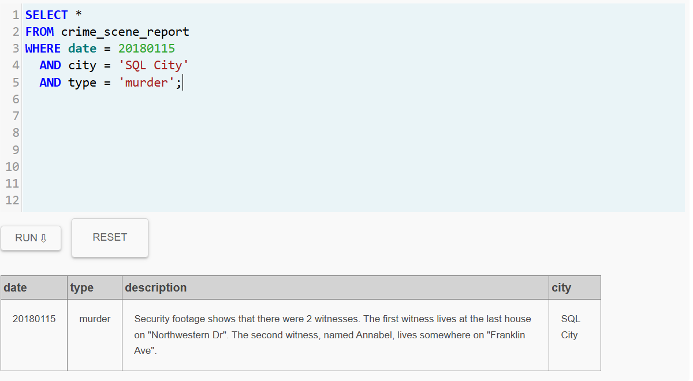

---

## Identificación de testigos

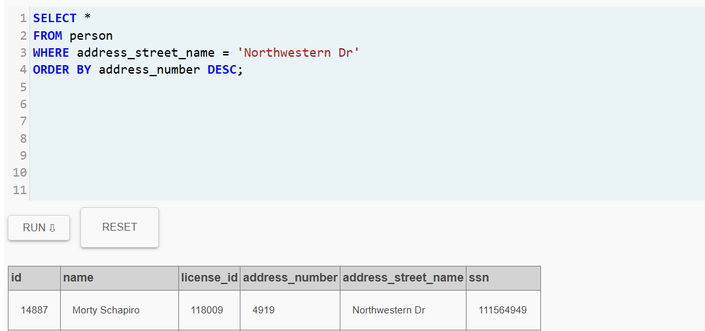

---

## Análisis de entrevistas

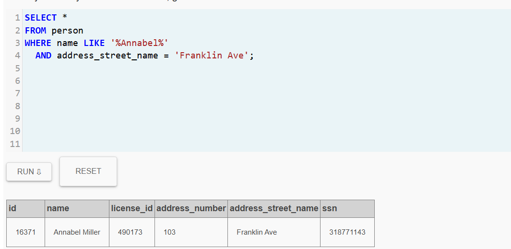

---

## Búsqueda de sospechosos en el gimnasio

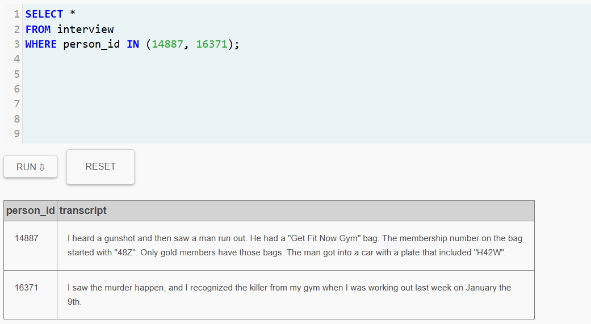

---

## Filtrado de miembros del gimnasio

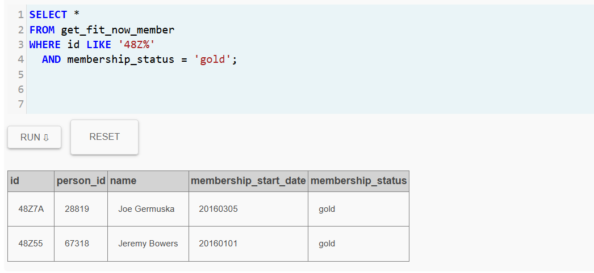

---

## Verificación de ingreso al gimnasio

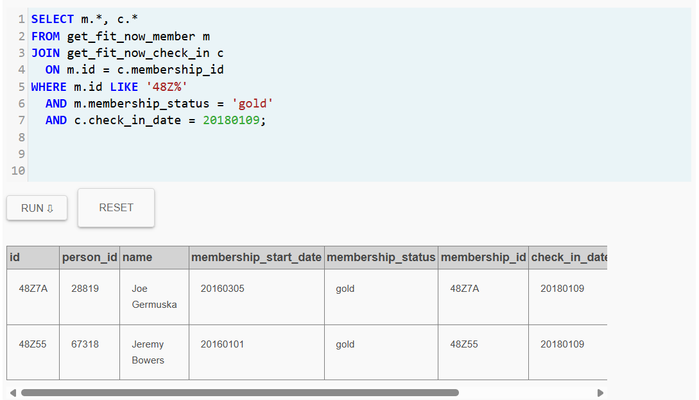

---

## Identificación de sospechosos

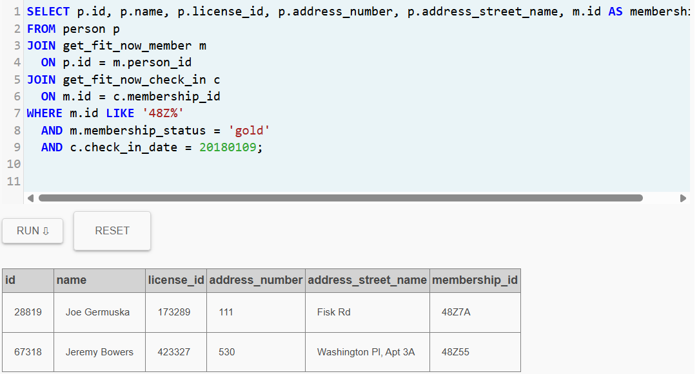

---

## Identificación del asesino

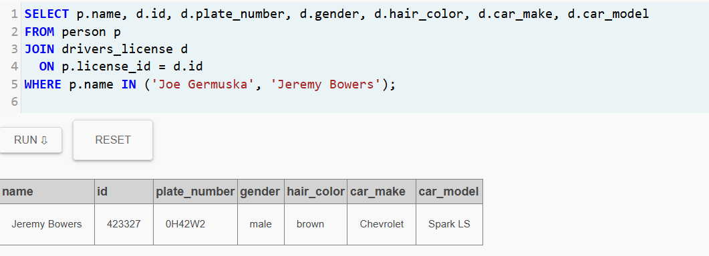

---

## Confesión del asesino

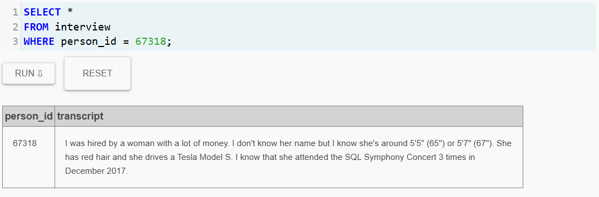

---

## Identificación del autor intelectual

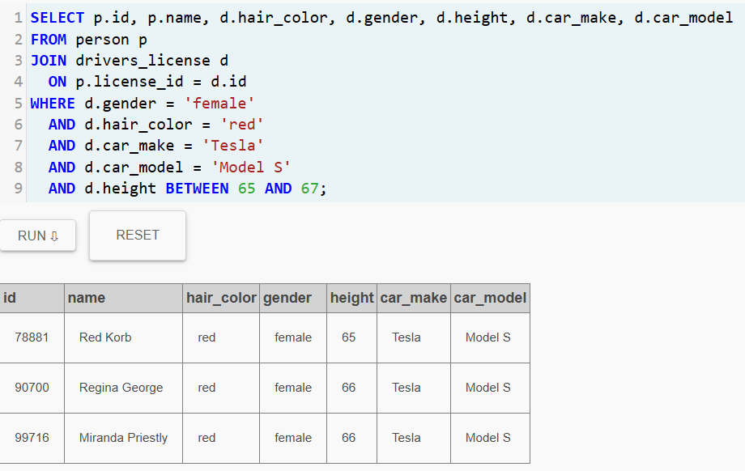

---

## Confirmación final del caso

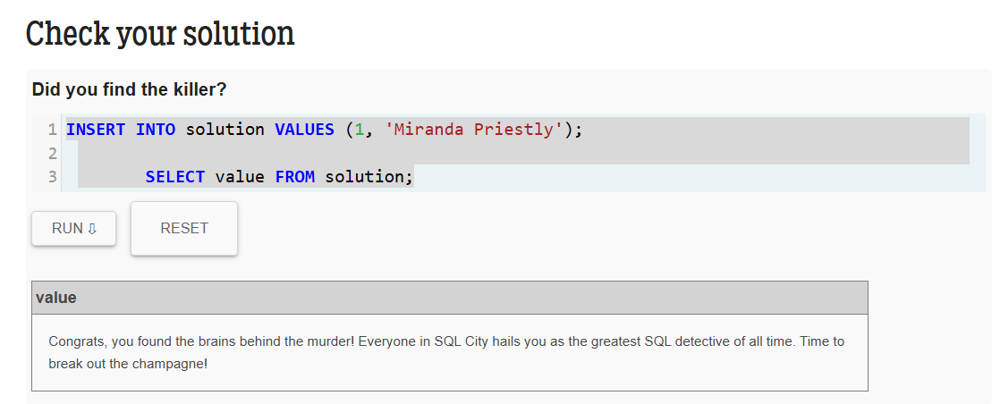
